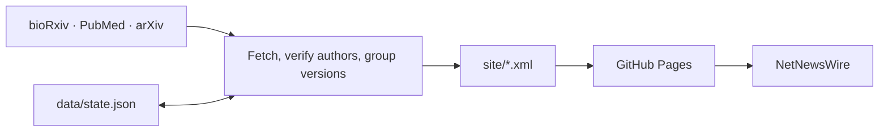

# Feed Me

[](https://github.com/dacarlin/feed-me/actions/workflows/tests.yml)
[](https://github.com/dacarlin/feed-me/actions/workflows/update-feeds.yml)

**Follow researchers from preprint to publication in your feed reader.**

Feed Me collects official bioRxiv, PubMed, and arXiv metadata, verifies author
identity, groups versions of the same work, and publishes **Atom 1.0 feeds** for
NetNewsWire. GitHub Actions runs the tracker; GitHub Pages serves the feeds.
Configuration lives in YAML, and the publication history lives in committed JSON.

[Subscribe](#subscribe) · [Quick start](#quick-start) · [How it works](#how-it-works) ·
[Configuration](#configuration) · [GitHub Pages setup](#github-pages-setup) ·
[Problems and fixes](#problems-and-fixes) · [Troubleshooting](#troubleshooting) ·
[Project layout](#project-layout)

## Subscribe

| Feed | Subscription URL |
| --- | --- |
| All configured researchers | [https://dacarlin.github.io/feed-me/all.xml](https://dacarlin.github.io/feed-me/all.xml) |
| David Baker — publications and preprints | [https://dacarlin.github.io/feed-me/david-baker.xml](https://dacarlin.github.io/feed-me/david-baker.xml) |
| Daniel Herschlag — publications and preprints | [https://dacarlin.github.io/feed-me/daniel-herschlag.xml](https://dacarlin.github.io/feed-me/daniel-herschlag.xml) |

In NetNewsWire, choose **File → New Feed** (`⌘N`), paste the full URL, and add it
to your preferred account. The [feed directory](https://dacarlin.github.io/feed-me/)
also lists the available subscriptions.

The combined feed follows David Baker and Daniel Herschlag. Subscribe to
`all.xml` for both researchers, or choose their individual feeds. An existing
subscription to `david-baker.xml` includes only Baker's papers.

## Quick start

Requires **Python 3.11+**. From the repository root:

```bash
python3 -m venv .venv
source .venv/bin/activate
python -m pip install -e '.[test]'
python -m pytest
```

Preview an update:

```bash
python -m pubtracker update --dry-run --output-dir /tmp/pubtracker-preview
open /tmp/pubtracker-preview/index.html  # macOS; otherwise open it in your browser
```

**A dry run makes real API requests.** It leaves the saved state and published
site untouched; only an explicitly requested preview directory is written.
Tests use synthetic fixtures and prohibit network requests.

Save an update locally:

```bash
python -m pubtracker update
```

Commit `data/state.json` and `site/` together after a local update. State preserves
entry IDs, matching evidence, and checkpoints between runs. Use one updater at
a time; avoid running a local update alongside the scheduled workflow.

### Backfill an earlier period

`--since` overrides the discovery start date, including existing checkpoints:

```bash
python -m pubtracker update --since 2026-08-01 --dry-run
python -m pubtracker update --since 2026-08-01
```

Choose a start date appropriate for your reading list. bioRxiv backfills scan
all papers in the interval before filtering researchers, so a long backfill can
take many minutes. The workflow also accepts an optional `since` input for
manual runs.

## How it works



### Discovery and update schedule

| Setting | Default behavior |
| --- | --- |
| Scheduled workflow | Every three hours, at minute 17 in UTC |
| Initial discovery | Look back 30 days |
| Subsequent discovery | Resume from each source's last success, with two days of overlap |
| bioRxiv publication links | Scan at least the last 30 days separately from preprint discovery |
| Tracked record refresh | Every seven days, to find metadata changes and publication links |
| arXiv queries | Reuse a successful result for the rest of its UTC day |
| Feed size | Up to 200 works per feed; older works remain in state |

All date windows use **UTC**. PubMed searches publication, creation, and revision
dates, covering papers indexed before publication as well as late indexing and
corrections. arXiv uses a separate, stable query per surname, with 25 records per
page, and scans by descending update date to include revised older submissions.
Shared papers are deduplicated, preserving the highest version returned. Its
daily reuse follows the [API's query guidance](https://info.arxiv.org/help/api/user-manual.html#_feed_metadata).
A new UTC day, changed researcher configuration, or explicit `--since` triggers
a fresh arXiv query. Failed attempts are never cached as successes.

### Author identity

A compatible name is a discovery candidate. Acceptance requires an exact,
checksum-valid configured ORCID, or a compatible name with sufficient evidence
from **that author's own affiliations**.

For David Baker, the affiliation route requires University of Washington plus
Institute for Protein Design or Department of Biochemistry. A conflicting valid
ORCID rejects a name/affiliation match. Initials such as `Baker, D.` still need
affiliation evidence; unconfigured middle names are not inferred.

The configured ORCID, `0000-0001-7896-6217`, is supported by the
[PNNL EMSL profile](https://www.emsl.pnnl.gov/people/david-baker) and page 20 of a
[Baker Lab-hosted eLife paper](https://www.bakerlab.org/wp-content/uploads/2018/06/elife-28909-v2-1.pdf).

For Daniel Herschlag, the affiliation route requires Stanford University plus
Department of Biochemistry or Department of Chemical Engineering. His
[official Stanford profile](https://profiles.stanford.edu/daniel-herschlag)
confirms these appointments and ORCID `0000-0002-4685-1973`; see also the
[Herschlag Lab](https://herschlaglab.stanford.edu/). His configuration searches
bioRxiv, PubMed, and arXiv, including compatible initials such as `Herschlag, D.`.

bioRxiv supplies the corresponding author's institution, so it is attached only
when that name identifies exactly one listed author. A coauthor's affiliation
never establishes another author's identity. arXiv often omits affiliations,
which can leave name matches unconfirmed. Records may inherit identity through a strong
link to an already identified work, such as a shared DOI or explicit publication
relationship. Title similarity alone cannot establish identity.

### Paper versions and reader dates

Each work has a persisted `urn:uuid:…` entry ID. A later journal version can
update its title, link, abstract, status, and `updated` timestamp while preserving
its ID and `published` timestamp.

The Atom publication timestamp uses the first known bibliographic date, which
lets [NetNewsWire sort by paper date](https://github.com/Ranchero-Software/NetNewsWire/blob/main/Shared/Timeline/ArticleSorter.swift).
Partial dates use the first day of the known month or year; missing or invalid
dates fall back to discovery time. Older state gains the publication timestamp
on loading while preserving IDs and `first_seen`. Feed selection prioritizes
the preferred record's bibliographic date before applying the entry limit.

If two previously emitted works are later linked, the earliest first-seen work's
ID survives and the other becomes an alias. A reader may retain an already
downloaded duplicate in its local history. When only a publication link is
known, the entry identifies its title and abstract as preprint metadata.

<details>
<summary>Deduplication rules</summary>

The ordered rules in [dedupe.py](src/pubtracker/dedupe.py) are:

1. Explicit version relationships, including arXiv journal DOIs and PubMed
   preprint `UpdateIn` links. `UpdateOf` applies only when its target is a preprint.
2. bioRxiv published-version metadata from the details and publication endpoints.
3. Shared normalized DOIs, source IDs, or other article-scoped identifiers.
4. Identical normalized titles with at least two overlapping authors and 50%
   overlap in the smaller author list. Titles must have at least six words and
   40 characters, and publication years must be within five years.
5. Fuzzy titles with similarity ≥0.97, token overlap ≥0.85, at least three
   overlapping authors, ≥80% author overlap, a matching first author, and
   publication years within two years. Numbers and basic negations must agree.

Title rules do not merge separate journal articles or separate submissions within
the same source. Multiple plausible title candidates remain separate. Source
records and merge decisions remain inspectable in state.

</details>

## Configuration

Edit [config/feeds.yaml](config/feeds.yaml). Researchers define identity rules and
sources; feeds define unions of researcher IDs. A minimal complete configuration:

```yaml
site:
  title: Research publications
  base_url: https://dacarlin.github.io/feed-me
  max_entries: 200

researchers:
  - id: david-baker
    name: David Baker
    orcid: 0000-0001-7896-6217
    affiliations:
      - Institute for Protein Design
      - University of Washington
      - Department of Biochemistry
    required_affiliations:
      - University of Washington
    min_affiliation_matches: 2
    sources: [biorxiv, pubmed, arxiv]

feeds:
  - id: all
    title: All researchers
    researchers: [david-baker]
  - id: david-baker
    title: David Baker — publications and preprints
    researchers: [david-baker]
```

Add a researcher under `researchers`, then include their ID in the desired feeds.
Researcher IDs and feed IDs must each be unique lowercase slugs. Optional
`update` settings control the windows shown above; omitted settings use defaults.
Set `NCBI_EMAIL` or `update.ncbi_email` to supply an optional contact email to NCBI.

Identity/source edits re-evaluate stored evidence and restart the initial
discovery window for affected sources. Use `--since` for a longer backfill.
Keep feed IDs and `site.base_url` stable after subscribing. Remove obsolete XML
files from `site/` when intentionally deleting or renaming a feed.

## GitHub Pages setup

1. Push the project to your repository's default branch. Include configuration,
   state, generated feeds, and both workflows.
2. Set `site.base_url` to your Pages URL. A fork typically uses
   `https://YOUR-USERNAME.github.io/YOUR-REPOSITORY`.
3. Under **Settings → Pages → Build and deployment → Source**, select
   **GitHub Actions**. Use the included workflow; see GitHub's
   [publishing-source guide](https://docs.github.com/en/pages/getting-started-with-github-pages/configuring-a-publishing-source-for-your-github-pages-site).
4. Allow the workflow's bot to push state commits to the default branch. The
   workflow requests `contents: write` for updates and `pages: write` plus
   `id-token: write` for deployment, using the automatic `GITHUB_TOKEN`.
5. Optionally add `NCBI_EMAIL` as a repository Actions variable.
6. Open **Actions → Update publication feeds → Run workflow**. Supply `since`
   only when a backfill is needed. Verify the Pages deployment and feed links.

The [update workflow](.github/workflows/update-feeds.yml) tests the code, fetches
metadata, commits state and feed changes, then uploads and deploys `site/`.
Code, configuration, package metadata, and update-workflow changes pushed to
`main` also trigger it. Adjust the branch filter if your default branch differs.
README-only and generated-output-only changes do not trigger feed deployment;
the [test workflow](.github/workflows/tests.yml) runs on pushes and pull requests.

Updates are serialized and never force-pushed. If another push overtakes a bot
commit, rerun on the current default branch. GitHub may delay scheduled runs;
see its [schedule documentation](https://docs.github.com/en/actions/reference/workflows-and-actions/events-that-trigger-workflows#schedule).

## Problems and fixes

These incidents were reproduced during live operation. Article counts and test
totals below are verification snapshots for the corresponding versions.

### v0.1.1 — discovery, feed dates, and deployment

| Problem we observed | Cause | Fix |
| --- | --- | --- |
| bioRxiv repeatedly timed out, leaving its checkpoint stuck | The implicit-format details URL timed out or returned an empty HTTP 200 response. The same dated request with `/json` returned metadata. | Explicitly request `/json` on every paginated details and publication call. |
| NetNewsWire showed only a handful of papers, including years-old articles | The seed window covered just seven days of indexing changes. Old PubMed records revised during that window could appear, while recent papers outside it were missing. | Expand initial discovery to 30 days, include PubMed publication dates alongside creation/revision dates, and backfill August 12–September 11, 2026. |
| Backfilled papers had the same reader date and appeared in an arbitrary order | Atom `published` used the tracker’s discovery time. NetNewsWire sorts by publication date and breaks date ties by article ID. | Persist a bibliographic publication timestamp, migrate existing state without replacing IDs, and prioritize recent bibliographic dates when limiting feed entries. |
| Pushing a fix did not immediately redeploy the feeds | The updater ran only on a schedule or manual dispatch. | Trigger updates on relevant code/configuration pushes to `main`; add a manual `since` input for backfills. |
| Long bioRxiv scans gave little indication of progress | Backfills page through the global corpus, and only stream-level messages were logged. | Log records fetched versus the total and include endpoint/cursor context in request and JSON errors. Large backfills still take time. |

Verification: the backfill scanned **6,193 bioRxiv records across 207 pages**.
The resulting feeds contained **53 matched works**, including a September 10
preprint. **69 tests passed**, and both deployed feeds were checked.

[Discovery and deployment fix](https://github.com/dacarlin/feed-me/commit/13b3293) ·
[Reader-date fix](https://github.com/dacarlin/feed-me/commit/f9907f4) ·
[Successful workflow](https://github.com/dacarlin/feed-me/actions/runs/34633003400)

### v0.1.2 — malformed records and rate limits

| Problem we observed | Cause | Fix |
| --- | --- | --- |
| bioRxiv stopped after logging `540/648 records fetched` with `record has no valid DOI` | An unrelated paper at offset 564 had an empty DOI. Every record was fully parsed before filtering authors, so that row aborted the entire stream. | Filter author names before validating DOI/title metadata. Matching candidates still require valid metadata; missing or malformed author fields and incomplete pages still fail visibly. DOI errors now include the paper title. |
| arXiv failed with an unhelpful `HTTPError` after three attempts | The response was **HTTP 429: Rate exceeded**. Two- and four-second retries were too short, and the updater repeated successful daily queries every three hours. | Use 30-/60-second cooldowns for 429s, honor `Retry-After`, log the actual status and retry delay, and reuse a successful arXiv checkpoint for the rest of the UTC day. Explicit backfills and configuration changes bypass reuse; failures never count as cached successes. |

Verification: the previously failing bioRxiv scan completed **all 648 records**;
arXiv recovered after a **30-second cooldown**. The live update finished with no
source failures, all **88 tests passed**, and both feeds retained **53 works**.
The following GitHub run reused the successful arXiv checkpoint while advancing
the other sources.

[Fix and regression tests](https://github.com/dacarlin/feed-me/commit/c71dfdf) ·
[Successful workflow](https://github.com/dacarlin/feed-me/actions/runs/34731162537)

### v0.1.3 — arXiv capacity errors and smaller queries

After adding Herschlag, arXiv again returned HTTP 429 and timed out. A live check
also reproduced the 429 with the original Baker-only query. arXiv's maintainers
[explain that this specific `Rate exceeded` response can indicate exhausted server capacity](https://groups.google.com/a/arxiv.org/g/api/c/pNB3lnxf4mQ),
even for light usage. The earlier diagnosis of client rate limiting was incomplete.

| Problem | Change |
| --- | --- |
| A combined surname query changed whenever another researcher was added | Query each distinct surname separately, preserving stable GET queries that can reuse arXiv's server cache. Surname-only discovery still covers abbreviated names. |
| Large responses and slow requests increased exposure to timeouts | Reduce discovery and refresh batches from 100 records to 25; allow 90 seconds for arXiv reads. |
| Brief retries did not allow an overloaded service to recover | Use 60-/120-second cooldowns for arXiv transient errors, including timeouts and 5xx responses. Honor `Retry-After` up to 120 seconds; longer requested waits leave the stream for a later run. Wait at least 3.1 seconds after each response before another request. |
| Multi-author scans needed clear progress and failure boundaries | Log each surname's page progress and identify the failing surname. Deduplicate shared papers using the highest returned version. If any author query or refresh fails, retain the source checkpoint and discard the incomplete batch. |

Verification: **99 offline tests pass**, including multi-author pagination,
overlapping papers and versions, revised older submissions, incomplete batches,
slow-response pacing, and bounded retries. These changes improve recovery; they
cannot guarantee availability while arXiv's servers are overloaded. An exhausted
retry budget remains a visible failure, and the next scheduled run retries the
missing discovery window.

### Why a red workflow can still publish a working feed

Source failures are isolated. Successful streams update state and feeds, and
the workflow deploys those results before reporting a source failure. The CLI
exits **1** when any stream fails. This behavior was already present when the
first timeout was investigated.

A failed stream retains its checkpoint and discards its incomplete batch, so a
future run can retry the missing window. Genuine API outages, malformed matching
candidates, and incomplete pagination remain visible failures.

## Troubleshooting

| What you see | What it means / what to check |
| --- | --- |
| `checkpoint retained` | That stream did not complete. Inspect the preceding error; the next run retries from its last successful checkpoint. |
| `HTTP 429; retrying in ...` | The provider is throttling requests or is overloaded; arXiv's `Rate exceeded` response can mean server capacity. Cooldowns are automatic. A requested `Retry-After` over 120 seconds for arXiv, or 60 seconds for other providers, leaves the stream for a later run. |
| `Skipping arxiv: already fetched successfully ...` | A successful result exists for this UTC day and researcher configuration. The summary records it in `skipped_sources`; its checkpoint does not advance. |
| Many records fetched, few accepted | bioRxiv scans all researchers before filtering. Name candidates must then satisfy the identity policy. |
| `accepted_records` increases but `works` does not | Accepted records can update existing works or add another version. The count is not a count of newly discovered papers. |
| An expected paper is missing | Check source checkpoints, the discovery window, and author evidence. Use a backfill or inspect a stored rejection with `diagnose`. |
| An old paper appears | It may have been newly indexed or corrected. Its bibliographic date remains visible; a recent indexing change does not make it a new publication. |
| Bot commit/push fails | Check branch protections and workflow permissions. If a concurrent push caused the failure, rerun on the latest default branch. |

### Inspect a stored decision

```bash
python -m pubtracker diagnose '10.1038/s41586-026-10464-0'
```

`diagnose` accepts a DOI, source ID, or work UUID and reads local state only. For
example, the stored DOI above shows its source records, author evidence, and
deduplication decisions. Rejected name candidates include reasons for rejection.
Records never retrieved, lacking even a compatible name, or removed from the
bounded rejection sample cannot be diagnosed. Dry-run results are not saved.

<details>
<summary>State fields and manual repairs</summary>

| Field in <code>data/state.json</code> | Purpose |
| --- | --- |
| `schema_version` | Prevent loading an unsupported state format |
| `checkpoints` | Last successful timestamp and researcher-configuration fingerprint per stream |
| `refresh` | Last refresh time for tracked source records |
| `works` | Stable IDs, bibliographic and discovery timestamps, source records, identity evidence, and merge decisions |
| `aliases` | Retired work IDs mapped to their surviving IDs |
| `rejected` | Up to 500 rejected name candidates and their explanations |
| `identity_config` | Fingerprint used to re-evaluate identity after YAML changes |

Back up state before a manual repair. Preserve each work's `id`, `first_seen`,
and persisted `published` timestamp when possible. To undo an incorrect merge,
separate its source records and review matching evidence, deduplication history,
and aliases. Correct the underlying identity or relationship data too, or a
future fetch may repeat the merge.

Older non-empty metadata and relationships survive omissions in later responses;
explicit removal requires a repair. Writes are atomic per file, with state saved
before feeds so a failed feed write can be retried using the saved IDs. Commit
state and regenerated output together.

</details>

## Project layout

| Path | Purpose |
| --- | --- |
| [config/feeds.yaml](config/feeds.yaml) | Researchers, identity rules, feeds, and update windows |
| [src/pubtracker/cli.py](src/pubtracker/cli.py) | Update orchestration, checkpoints, and diagnostics |
| [src/pubtracker/sources/](src/pubtracker/sources/) | bioRxiv, PubMed, and arXiv adapters |
| [src/pubtracker/http.py](src/pubtracker/http.py) | Request pacing, timeouts, and bounded retries |
| [src/pubtracker/matching.py](src/pubtracker/matching.py) | Author identity checks |
| [src/pubtracker/dedupe.py](src/pubtracker/dedupe.py) | Version relationships and conservative work grouping |
| [src/pubtracker/state.py](src/pubtracker/state.py) | Persistent IDs, metadata merging, and atomic writes |
| [src/pubtracker/feed.py](src/pubtracker/feed.py) | Atom feeds and the subscription index |
| [data/state.json](data/state.json) | Committed publication history and source checkpoints |
| [site/](site/) | Generated site served by GitHub Pages |
| [tests/](tests/) | Offline regression tests and synthetic fixtures |
| [.github/workflows/](.github/workflows/) | Tests, scheduled updates, and deployment |

## Scope and limitations

This tracker is intended for a small personal reading list. Source metadata can
be incomplete or delayed; strict identity checks can miss real papers. Weekly
refreshes help with tracked works, while papers missed entirely may require a
backfill. PubMed queries above 9,999 results fail explicitly; narrow the window
or researcher configuration.

Requests are sequential and paced: at least 0.4 seconds apart for NCBI, 3.1 for
arXiv, and 1 for bioRxiv. arXiv's gap starts after the preceding request finishes.
Transient failures get up to three attempts. arXiv reads allow 90 seconds and
use 60-/120-second cooldowns; other sources retain 45-second reads and shorter
retries. Diagnostics omit query parameters to avoid exposing credentials or
contact information.

Feeds include API-provided abstracts and source links. There is no full-text,
PDF, HTML article, or JATS scraping, no Crossref/OpenAlex enrichment, and no
comprehensive retraction tracking. Missing relationships or major title changes
can leave duplicate works; a static feed cannot erase a reader's local history.
GitHub Pages output is publicly readable.

API references: [bioRxiv](https://api.biorxiv.org/) ·
[NCBI E-utilities](https://www.ncbi.nlm.nih.gov/books/NBK25501/) ·
[arXiv manual](https://info.arxiv.org/help/api/user-manual.html) ·
[arXiv rate limits](https://info.arxiv.org/help/api/tou.html)
